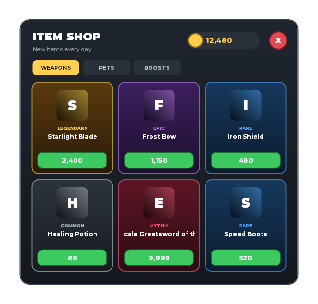
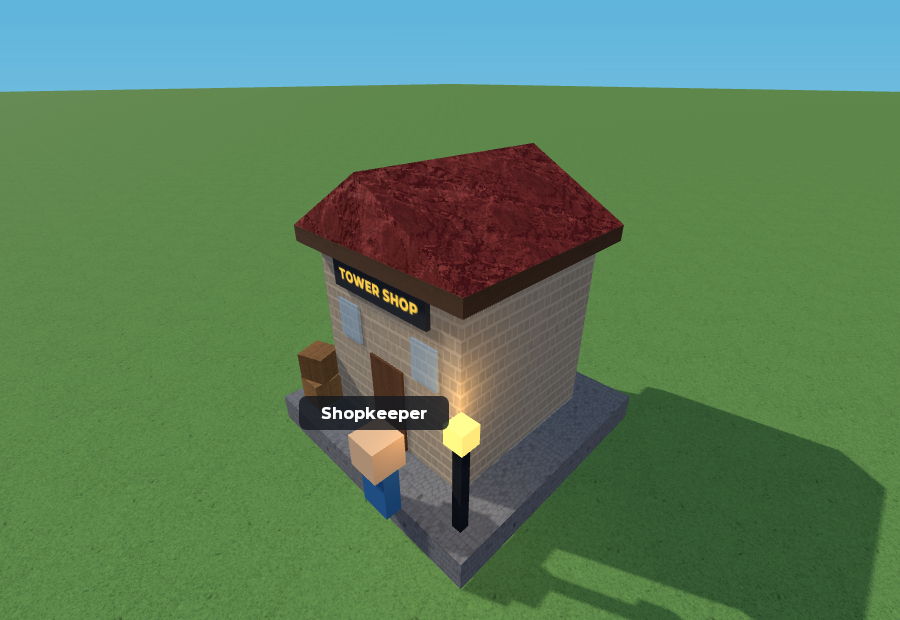

# roblox-headless-renderer (rhr)

**See Roblox UI and 3D builds from the command line.** Point `rhr` at a `.rbxm`,
`.rbxmx`, `.rbxl` or `.rbxlx` file, or a Rojo project, and get a preview PNG plus
JSON: where everything is, how big it is, what overlaps, what is clickable, and what
looks broken. It is built for AI agents that make Roblox content and need to check
their work. It also works for people who just want a quick look from the command
line or in CI. No GPU or display is needed.

<p align="center">
  
  
</p>

<p align="center"><sub>Both images come from <code>examples/</code>, rendered by <code>rhr render</code> and <code>rhr scene --view iso</code>.</sub></p>

> **Status: v0.5, an early alpha.** The UI layout numbers are solid: they match
> Studio within 2 px on every test place. The pictures are *previews*: close enough
> to spot mistakes, not a copy of Studio's renderer. Anything RHR can't draw
> faithfully, it says so in its output instead of guessing quietly. See
> [what is approximated](docs/known-approximations.md). Bug reports with a small
> file attached are very welcome.

## Install

You need Python 3.12 or newer, on Windows, macOS or Linux.

```sh
pip install git+https://github.com/TabooHarmony/roblox-headless-renderer
rhr setup     # downloads Lune (reads Roblox files), Rojo and Chromium (for 3D)
rhr doctor    # checks everything is in place
```

`rhr setup` puts the exact tool versions RHR is tested with (Lune 0.10.5, Rojo 7.7.0)
in RHR's own cache folder. Tools you already have on `PATH` are used first. On a bare
Linux machine Chromium may also need system libraries:
`python -m playwright install-deps chromium`.

## Try it

The repository has two example files ([`examples/`](examples/)):

```sh
git clone https://github.com/TabooHarmony/roblox-headless-renderer && cd roblox-headless-renderer
rhr render examples/shop.rbxmx --out shop.png         # the UI as a PNG
rhr check  examples/shop.rbxmx                        # obvious mistakes
rhr scene  examples/tower.rbxmx --view iso --out tower.png
```

The shop has one deliberate mistake, and `rhr check` finds it:

```json
{
  "check": "text-wider-than-box",
  "detail": "text estimated 461px wide in a 148px box with TextWrapped off",
  "paths": ["ShopGui/Shop/Items/Item5/ItemName"],
  "severity": "warning"
}
```

## Commands

| Command | What you get |
| --- | --- |
| `rhr render <file>` | PNG of the screen UI (every ScreenGui, in `DisplayOrder`), including ViewportFrames |
| `rhr layout <file>` | JSON: the on-screen rectangle of every UI element. `--rich` adds class, z-index, colours and how each text laid out |
| `rhr check <file>` | JSON findings for common UI mistakes: text that doesn't fit, zero-size grid cells, invisible content, ambiguous overlaps. Exits 1 on errors |
| `rhr hitmap <file>` | JSON: what is clickable, and which element is on top where things overlap |
| `rhr scene <file>` | PNG of the 3D build. Standard views (`--view iso/front/back/left/right/top`), `--focus <path>`, or your own `--camera` / `--look-at` / `--fov` |
| `rhr scene-dump <file>` | JSON: position, size, bounds and material of every part, plus everything that was approximated |
| `rhr preview <file>` | One PNG with the 3D world, in-world UI (BillboardGui, SurfaceGui) and screen UI together |
| `rhr compare a.png b.png` | How much changed between two renders, to tell a geometry change from a colour change |
| `rhr ir <file>` | The parsed file as JSON, including properties that could not be read |
| `rhr fetch <file>` | Download the images, meshes, unions and Roblox material textures a model uses into the local cache, as your Roblox Studio user. `scene` and `preview` do this themselves for whatever they are missing |
| `rhr setup` / `rhr doctor` | Install the external tools / check them |

Every JSON output carries a `schema` name (`rhr.layout/1`, `rhr.check/1`, ...), so a
change in shape is never silent. A Rojo project works anywhere a file does: pass the
folder with `default.project.json`, or the `*.project.json` file.

**Effects.** `scene` and `preview` draw ParticleEmitters, Beams and Trails inside the
3D scene as a still frame: hidden by walls, glowing where `LightEmission` says so.
Most VFX are played by a script; RHR runs no scripts, but reads the widely used
`EmitCount` / `EmitDelay` / `EmitDuration` attributes and plays the effect itself,
showing its fullest moment (`--effect-time T` for another, `--no-effects` to leave
them out). Emitters a script plays without those attributes are listed, not guessed.

**Experimental** (rough sketches, and labelled as such in the output): local lights,
Decals and Textures, and `rhr particles` (a contact sheet over time).

## For agents

Start with [`docs/AGENTS.md`](docs/AGENTS.md): which command answers which question,
an edit → check → preview loop, and how far to trust each output. `rhr-mcp` is an
MCP server with a subset of the commands (scene inspection, preview, compare) for
hosts that prefer tools to a shell. Install it with
`pip install "roblox-headless-renderer[mcp] @ git+https://github.com/TabooHarmony/roblox-headless-renderer"`.

3D renders use the GPU (about 8x faster than software rendering; set
`RHR_WEBGL=software` for identical pixels on every machine, as the tests do). For
repeated 3D renders, `rhr browser start` keeps one Chromium running in the
background, which makes each render faster still. RHR also remembers the last
conversion of each file, so running several commands on an unchanged file only reads
it once.

## Good to know

- **Top bar.** Screen UI is laid out below Roblox's 58 px top bar, as in a running
  game. Studio's edit view has none: pass `--topbar-height 0` to match it.
- **Roblox Studio is expected.** RHR is for people making Roblox content, so it
  assumes Roblox Studio is installed and signed in on the machine (it does not have to
  be running), and uses it by default:
  - **Downloads.** Before drawing, `scene` and `preview` download whatever the file
    uses that is not cached yet (meshes, unions, images at full size, and Roblox's
    own material textures), as the user signed in to Studio. Lune reads the login
    Studio saved and sends it only to Roblox's asset delivery, the same request
    Studio makes; RHR never sees, prints, logs or stores it. Anything already cached
    is never downloaded again. `--offline` (or `RHR_OFFLINE=1`) skips the download.
  - **The install's files.** The default sky, Plastic's surface relief and legacy
    surfaces (a Baseplate's studs) come from the Studio install, and RHR uses its fonts.
  - **Without Studio** every command still works: images come as 420 px thumbnails,
    meshes and unions are outlined boxes, materials use public-domain look-alike
    textures, and the sky is a gradient. RHR says so on stderr, because the result
    looks noticeably less like Roblox.
- **Terrain** is drawn smooth, meshed from the place's voxels the way Roblox does it,
  with Roblox's terrain textures (top, side and bottom). Where two materials meet the
  edge is hard; Roblox blends them.
- **Unions** are drawn with the exact shape and per-part colours Studio saved for them.
- **Place files.** In a `.rbxl`, only StarterGui's ScreenGuis are drawn; templates
  stored in ReplicatedStorage and elsewhere are named on stderr (`--all-guis` draws
  them).
- **Material textures** are Roblox's own, downloaded by the asset ids Roblox
  publishes in its documentation, tinted by the part's colour the way Roblox does it
  (Brick's mortar keeps its own colour), with their relief, roughness and metalness.
  `MaterialService.Use2022Materials` picks the current or pre-2022 set.
  `--flat-materials` draws plain colours.
- **Fonts.** With a Roblox or Studio install on the machine, RHR uses its fonts.
  Without one it uses bundled open-licence fonts, and a few Roblox-only faces are
  replaced by look-alikes.
- **Not an engine.** Scripts, physics and animation don't run. A UI that a script
  builds or moves at run time is shown as it is saved in the file.
- **Cache.** Everything RHR writes goes to one folder (`%LOCALAPPDATA%\rhr\cache`,
  `~/Library/Caches/rhr` or `~/.cache/rhr`). Set `RHR_CACHE_DIR` to move it.

## Development

```sh
git clone https://github.com/TabooHarmony/roblox-headless-renderer && cd roblox-headless-renderer
python -m venv .venv && . .venv/bin/activate      # Windows: .venv\Scripts\activate
pip install -e ".[dev,mcp]" && rhr setup
python -m pytest                                    # -m "not browser" skips the 3D tests
```

CI runs the suite on Ubuntu, Windows and macOS. [`docs/GOAL.md`](docs/GOAL.md) is the
project's direction and scope. `tests/studio/` holds places built in Studio with
Studio's own measurements saved inside; its README explains how to add one.

- `src/rhr/`: the package (file reading, UI layout and drawing, 3D scene, CLI, MCP).
- `src/rhr/vendor/pinevex/`: the 2D renderer RHR builds on (Apache-2.0), with fixes
  recorded in `patches/`.
- `src/rhr/vendor/three/`: THREE.js for the 3D preview, bundled, so nothing is loaded
  from a CDN.

## License

Apache License 2.0. Bundled third-party code and fonts are listed in
[`THIRD_PARTY_NOTICES.md`](THIRD_PARTY_NOTICES.md). Test fixtures and examples are
made for this repository; no third-party game content is included.

RHR is an independent project, not affiliated with or endorsed by Roblox
Corporation. Roblox is a trademark of Roblox Corporation.
